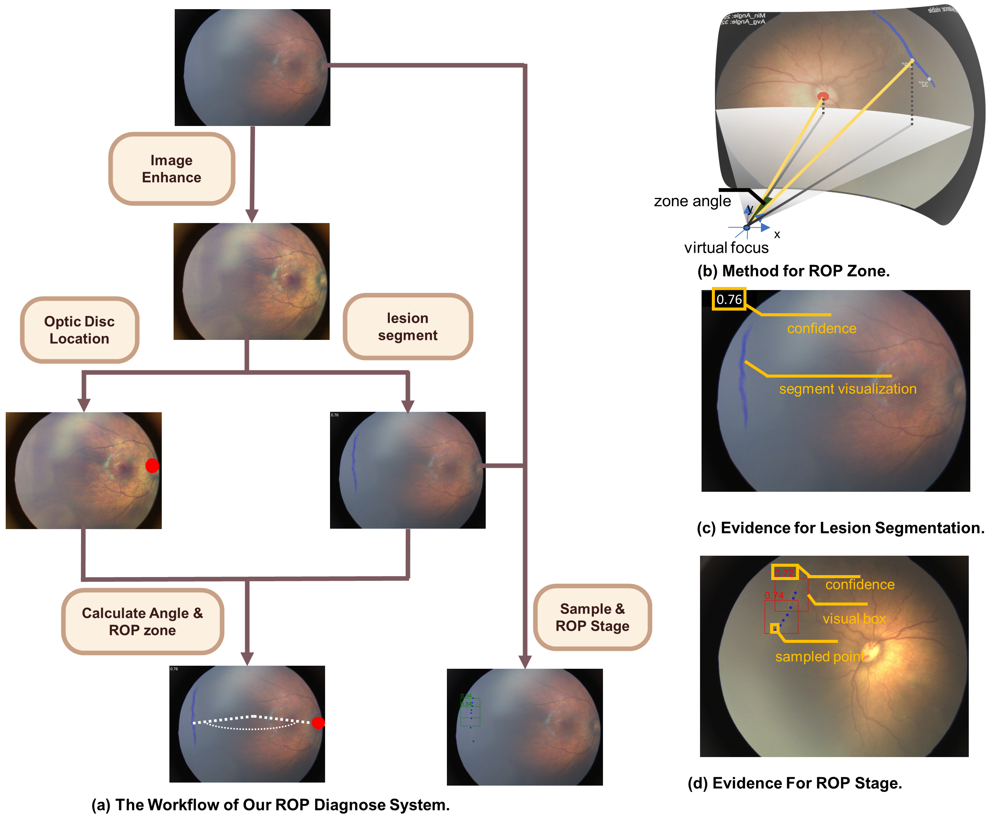

# Official Implementation for "ROP-Marker: an evidence-oriented AI assistant for ROP diagnosis"
This repository mainly contains the code for "ROP-Marker: an evidence-oriented AI assistant for ROP diagnosis." Since the project involves several relatively independent modules, each supporting independent reuse, we have divided it into different code repositories. We hope this project's code can assist you, and if you have any questions, please feel free to raise them in the issues section. [说明文档官中版](./说明.md)

Project workflow diagram:

<div align="center">
    
</div>

## code directory

- **Image Enhancement**: This repository [./ImageEnhancer.py](./ImageEnhancer.py)
- **Optic Disc Location**: [https://github.com/defensetongxue/optic_disc_location](https://github.com/defensetongxue/optic_disc_location)
- **Lesion Segmentation**: [https://github.com/defensetongxue/ridge_segmentation](https://github.com/defensetongxue/ridge_segmentation)
- **ROP Zone Calculation (Angle Calculation)**: [https://github.com/defensetongxue/ROP_Zone](https://github.com/defensetongxue/ROP_Zone)
- **ROP Staging (Sample and Stage)**: [https://github.com/defensetongxue/ROP_stage](https://github.com/defensetongxue/ROP_stage)
- **ROP Baseline Models**: We have rebuilt other models currently used in the industry for ROP testing. Reference [https://github.com/defensetongxue/ROP_BaseLine](https://github.com/defensetongxue/ROP_BaseLine)
- **Demo**: We have conducted tests on the ShenZhenROPdataset. This repository can be used for testing on other datasets. We plan to release a set of models: [https://github.com/defensetongxue/ROP_demo](https://github.com/defensetongxue/ROP_demo)
- **Simulation Experiment**: We conducted simulation experiments and wrote a single HTML for related simulation experiments: [https://github.com/defensetongxue/ROP_assistance_demo](https://github.com/defensetongxue/ROP_assistance_demo)

## Usage

### code structure

To achieve collaboration across multiple repositories, my proposed solution is to have each repository use the same data structure as an interface.

```plaintext
data_path
    images
        1.jpg
        2.jpg
        ...
    enhanced
        1.jpg
        2.jpg
        ...
    ... other intermidium result folder
    annotations.json
```
`annotations.json` contains information for all the data. Each entry is a JSON object. When one repository operates on it, others will modify it accordingly, such as adding a key `"ridge_diffusion_path"` so that other repositories can access the generated ROP lesion segmentation labels.

Initially, `annotations.json` will include the initial file paths and IDs for each data entry, for example:

```python
# annotations initial example
{
    "1.jpg":{
        "id":1,
        "image_path": "data_path/images/1.jpg"
    },
    "2.jpg":{
        ...
    },
    ...
}
```

### File Organization
For ease of reuse, each repository is organized in the same style, and there is no one-click "Make everything ok" operation. Each file in the root directory of each project often serves various functions, such as:

- `train.py` for training the model
- `test.py` for testing, which may store results in a `record.json` file for plotting
- The `util` folder contains small tools, such as generating visual results or a single train and eval loop
- The `experiments` folder stores some intermediate results (records, plots, etc.) and also serves as a download directory for Torch pre-trained models
- The `checkpoint` folder stores model training results